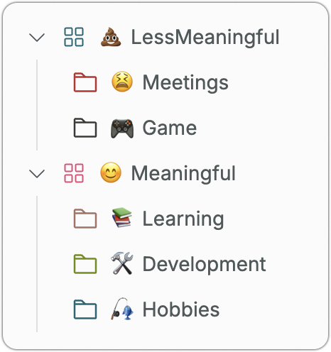

<h3 align="center">⏰<br>minute</h3>
<p align="center">The open-source time tracking app for individuals. </p>

## About

Minute is an open-source time tracking app.  
In contrast to other time tracking apps, Minute is mainly focused on individual use and is designed to help users review how they spend their time and use it more meaningfully.

## Screenshots


## Features

<h3>Folders</h3>

<p>Manage your tracked time entries with folders and analyze your recent time usage per folder on the report page. You can also view and edit created folders and time entries anytime from the sidebar.</p>

<h3>Categories</h3>

<p>Group multiple folders into a single category and use them for analysis on the report page. For example, create categories for time you want to reduce and time you want to increase, and use them on the report page.</p>

<h3>Custom Charts</h3>

<p>Use the created folders and categories to display increases and decreases in time usage on a chart. The items displayed on the chart can be freely customized according to your needs. Reflect on whether your time usage aligns with your ideal.</p>

## Built with

[Next.js](https://nextjs.org/)・[Tailwind CSS](https://tailwindcss.com/)・[tRPC](https://trpc.io/)・[Prisma](https://www.prisma.io/)・[NextAuth](https://next-auth.js.org/)・[next-intl](https://next-intl-docs.vercel.app/)・[Turborepo](https://turbo.build/)・[FactoryJS](https://github.com/factory-js/factory-js)

## Contributing

We always welcome to contributions!  
If you want to add new features or fix something, feel free to open a PR or issue.

## Running Locally

1. Clone this repository.

```sh
git clone git@github.com:ktmouk/minute.git
cd minute
```

2. Copy `.env.example` to `.env`.

```sh
cp packages/prisma/.env.sample packages/prisma/.env
cp apps/web/.env.sample apps/web/.env.local
```

3. Visit [GitHub Developer Settings](https://github.com/settings/developers) and create new OAuth app.

   - Application name: You can set a name of your choice.
   - Homepage URL: http://localhost:4000/
   - Authorization callback URL: http://localhost:4000/api/auth/callback/github

4. After creation, click the "Generate a new client secret" button and note the "Client ID" and "Client secret" values.

5. Set required envs in `apps/web/.env.local`: `NEXTAUTH_SECRET`, `GITHUB_ID` and `GITHUB_SECRET`.

```sh
vi apps/web/.env.local

NEXTAUTH_SECRET= # You can create a secure value by executing `openssl rand -base64 32`.
GITHUB_ID= # paste the client ID here.
GITHUB_SECRET= # paste the client secret here.
```

6. Install dependencies using pnpm:

```
pnpm install
```

7. Start Docker containers to run the Postgres database:

```
docker-compose up
```

8. Migrate the database and start the development server:

```
pnpm db:migrate:deploy && pnpm dev
```

9. That’s all! 🎉 Try accessing http://localhost:4000/app.

## License

[AGPLv3](./LICENSE)
